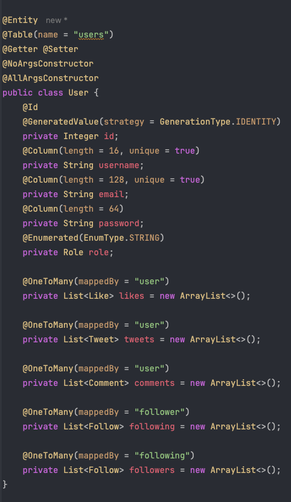
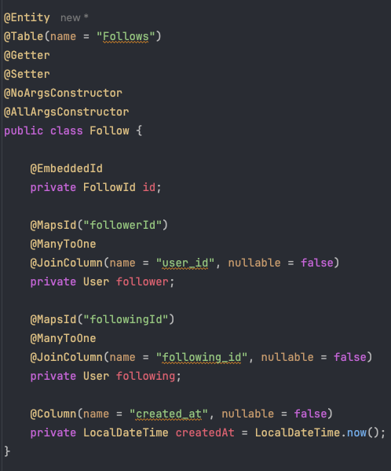
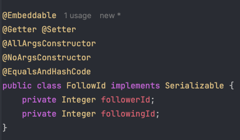
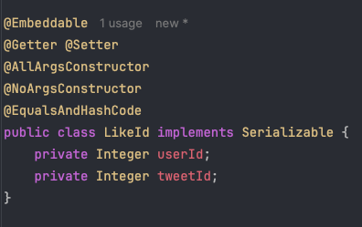
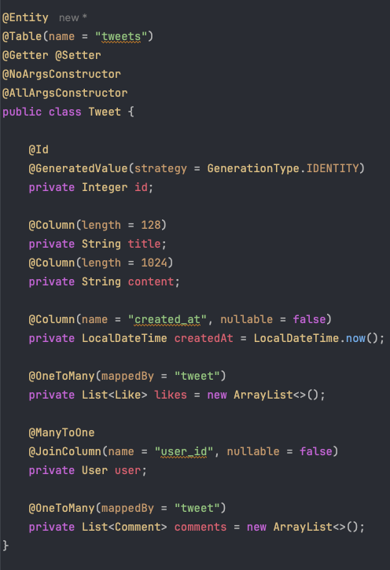
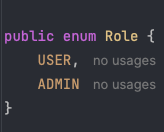
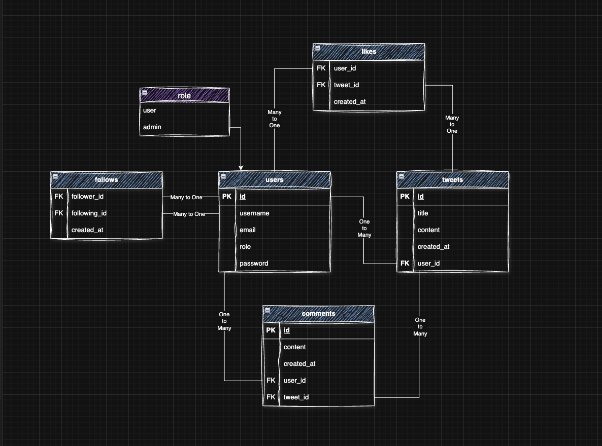

# 🧩 Архитектура базы данных
### На этом этапе выполнено проектирование базы данных и создание основных сущностей проекта. Ниже описана структура и логика построения модели данных.

## 🗄️ Используемая СУБД: PostgreSQL 

## 🧱 Сущности проекта
#### User

#### Follow и embedded FollowId
 

#### Like и embedded LikeId
 

#### Tweet

#### Comment

#### Role

## 📷 Схема базы данных

